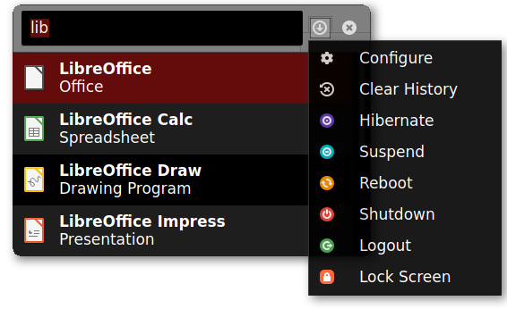
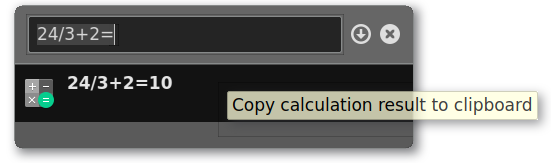

# lxqt-runner

## Overview

lxqt-runner provides a GUI that comes up on the desktop and allows for launching applications or shutting down the system. A calculator function is implemented too.

Technically it consists of a single binary `lxqt-runner`. The binary is run in a daemon-like manner as so-called LXQt Module and brings up the GUI when a configured keyboard shortcut is hit.

## Installation

### Compiling source code

Runtime dependencies are muparser, KWindowSystem, menu-cache and [lxqt-globalkeys](https://github.com/lxqt/lxqt-globalkeys).  
Additional build dependencies are CMake and optionally Git to pull latest VCS checkouts.  

Code configuration is handled by CMake. CMake variable `CMAKE_INSTALL_PREFIX` has to be set to `/usr` on most operating systems.  

To build run `make`, to install `make install` which accepts variable `DESTDIR` as usual.  

### Binary packages

Official binary packages are provided by all major Linux and BSD distributions. Just use your package manager to search for string `lxqt-runner`.

## Configuration, Usage

Launching binary `lxqt-runner` as LXQt Module can be adjusted from section "Basic Settings" in configuration dialogue "LXQt Session Settings" (binary `lxqt-config-session`) of [lxqt-session](https://github.com/lxqt/lxqt-session).

The keyboard shortcut to launch the GUI can be configured either in "Configure" in the lxqt-runner menu or in "Global Actions Manager" (binary `lxqt-config-globalkeyshortcuts`) of [lxqt-globalkeys](https://github.com/lxqt/lxqt-globalkeys).

In the configuration dialogue it's also possible to customize settings like the position where it's displayed, how many items to show and wether to use and save a history.

To launch an application corresponding strings need to be filed in the form, next a selection can be made from a list presenting matches. Items to shut down or restart the system and so on are provided by the menu featuring the configuration dialogue as well.

### Translation

Translations can be done in [LXQt-Weblate](https://translate.lxqt-project.org/projects/lxqt-desktop/lxqt-runner/)

